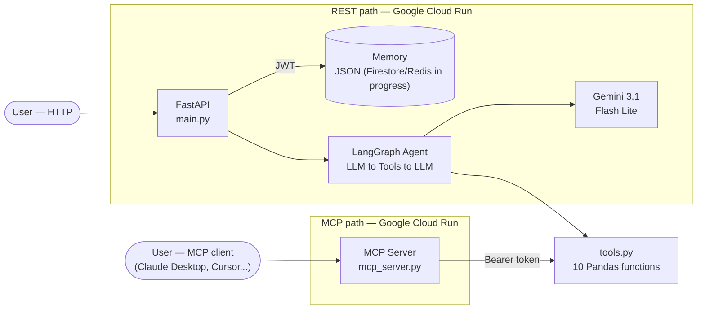

<div align="center">

# Sales Intelligence Agent

[](https://www.python.org/)
[](https://fastapi.tiangolo.com/)
[](https://langchain-ai.github.io/langgraph/)
[](https://cloud.google.com/)
[](https://ai.google.dev/)
[](https://modelcontextprotocol.io/)
[](https://www.docker.com/)
[](https://opensource.org/licenses/MIT)

**Conversational sales analysis agent with LangGraph + Model Context Protocol (MCP)**

</div>

> Natural language queries over enterprise sales data, without SQL or a BI dashboard. Two access paths — a REST API and an MCP server — share the same business logic and are deployed independently on **Google Cloud Run**.

## Architecture



Both paths call the exact same `tools.py` — no business logic duplicated. FastAPI owns the reasoning loop (LangGraph); MCP exposes the tools and lets the client's own LLM reason over them. Both services run on **Google Cloud Run** with independent deployments.

## Tech Stack

| Layer | Technology |
|---|---|
| **Orchestration** | LangGraph, LangChain |
| **LLM** | Google Gemini 3.1 Flash Lite |
| **API** | FastAPI, JWT auth |
| **Data** | Pandas, 15K+ transaction dataset |
| **Memory** | JSON (current) to Firestore/Redis (in progress) |
| **Infra** | Docker, Google Cloud Run (REST & MCP), Artifact Registry |
| **CI/CD** | GitHub Actions (tests + Docker build), Cloud Build (MCP deploy) |
| **Observability** | LangSmith tracing |
| **Testing** | 55 automated tests (Pytest) + 3 manual eval scripts |

## Endpoints

| Method | Route | Description | Auth |
|---|---|---|---|
| GET | `/` | Health check | None |
| POST | `/auth/token` | Obtain JWT token | Public |
| GET | `/ventas/resumen` | Sales summary | None |
| POST | `/chat` | Conversation, in-session memory | Bearer |
| POST | `/chat/persistent` | Conversation, persistent memory | Bearer |
| GET/DELETE | `/memory/{session_id}` | View / clear history | Bearer |

```bash
curl -X POST http://localhost:8000/chat \
  -H "Authorization: Bearer <TOKEN>" -H "Content-Type: application/json" \
  -d '{"session_id": "user-123", "question": "Who is the top seller?"}'
```

## LangGraph Agent

State graph with 2 nodes (`node_llm` and `node_tools`) plus a routing function (`should_continue`). 10 decoupled tools in `tools.py`, agnostic to the orchestrator — LangGraph on the REST path, the client's own LLM on the MCP path.

## Memory

| Backend | Status |
|---|---|
| `InSessionMemory` (RAM) | Active — dev/demo |
| `PersistentMemory` (local JSON) | Active — current default. **Note:** On Cloud Run, local JSON is ephemeral per instance. For true persistence across restarts, Firestore/Redis integration is in progress. |
| `CosmosMemory` (Azure Cosmos DB) | Deprecated — code present, disconnected |
| Firestore / Redis | **In progress** — replacing local JSON now that both services run on GCP |

## MCP Server

`app/mcp_server.py` wraps `tools.py` directly — same 10 tools, no HTTP client or LangGraph knowledge required. Runs local over stdio or remote over streamable-http, bearer-token authenticated. Deployed on **Google Cloud Run**, built and released via `cloudbuild.yaml`:

```bash
gcloud builds submit --config cloudbuild.yaml \
  --substitutions=_REGION=us-central1,_REPO=sales-mcp-repo,_IMAGE=sales-intelligence-mcp,_SERVICE=sales-intelligence-mcp .
```

**Important:** The `$SHORT_SHA` substitution in `cloudbuild.yaml` is only populated when Cloud Build is triggered by a **Cloud Build Trigger** (e.g., GitHub trigger). For manual `gcloud builds submit` commands, the tag will be empty. To work around this:
- **Option A:** Create a Cloud Build Trigger connected to your GitHub repository
- **Option B:** Manually specify a tag: `--substitutions=SHORT_SHA=$(git rev-parse --short HEAD)`

Each build is tagged and deployed by commit SHA (not `:latest`), so every release is traceable and rollback doesn't require a rebuild. `MCP_AUTH_TOKEN` lives in Secret Manager.

Claude Desktop only speaks local `stdio`, so reaching the remote Cloud Run instance goes through a small local bridge script (`claude-bridge.py`) that forwards stdio to HTTP with the bearer token. Clients with native remote MCP support (Cursor, Windsurf, VS Code+Cline) connect directly via URL — no bridge needed.

## Tests

```bash
pytest tests/test_tools.py -v   # 31 unit tests
pytest tests/test_api.py -v     # 13 integration tests (mocked LLM)
pytest tests/test_memory_truncation.py -v  # 8 tests
pytest tests/test_rate_limit.py -v  # 3 tests
# Total: 55 automated tests

# Manual scripts (require API keys, not run in CI):
python scripts/test_langsmith.py        # 12-question eval with LangSmith tracing
python scripts/verificar_memoria_manual.py  # manual memory verification
python scripts/test_meses_no_contiguos.py   # consistency check (5 runs)
```

## Local Setup

```bash
pip install -r requirements.txt
# configure .env - see Environment Variables below
uvicorn app.main:app --reload   # then open http://localhost:8000/docs
```

## Environment Variables

| Variable | Purpose | Default |
|---|---|---|
| `GOOGLE_API_KEY` | Gemini API key | — |
| `JWT_SECRET_KEY` | JWT signing key | — (required in production) |
| `MEMORY_BACKEND` | Memory backend (only `json` wired today) | `json` |
| `PORT` | Port for REST API (Cloud Run) | `8080` |
| `LANGCHAIN_TRACING_V2` / `LANGCHAIN_API_KEY` | LangSmith tracing | `false` / — |
| `LANGCHAIN_PROJECT` | Project name for LangSmith | `sales-agent` |
| `GEMINI_MODEL` | Modelo de Gemini a usar | `gemini-3.1-flash-lite` |
| `RATE_LIMIT_PER_MINUTE` | Límite de requests por minuto | `60` |
| `CORS_ALLOWED_ORIGINS` | Orígenes permitidos para CORS | `*` |
| `JWT_EXPIRE_MINUTES` | Duración del token JWT | `60` |

### MCP Server Variables

| Variable | Purpose | Default |
|---|---|---|
| `MCP_AUTH_TOKEN` | Bearer token for MCP authentication | — (required) |
| `MCP_TRANSPORT` | Transport mode (`stdio` or `streamable-http`) | `stdio` |
| `ALLOWED_HOST` | Host pattern for MCP auth (Cloud Run URL) | — |
| `PORT` | Port for MCP server | `8080` |

### Google Cloud Run Deployment

When deploying to Google Cloud Run, use **Secret Manager** to handle sensitive credentials securely:

```bash
# 1. Create secrets in Secret Manager
echo "your-very-long-jwt-secret-key" | gcloud secrets create jwt-secret-key --data-file=-
echo "your-google-api-key" | gcloud secrets create google-api-key --data-file=-

# 2. Deploy with secrets mounted as environment variables
gcloud run deploy sales-agent \
  --image us-central1-docker.pkg.dev/PROJECT_ID/sales-mcp-repo/sales-agent:latest \
  --region us-central1 \
  --allow-unauthenticated \
  --set-secrets="JWT_SECRET_KEY=jwt-secret-key:latest,GOOGLE_API_KEY=google-api-key:latest" \
  --set-env-vars="GEMINI_MODEL=gemini-3.1-flash-lite,RATE_LIMIT_PER_MINUTE=60,CORS_ALLOWED_ORIGINS=*"
```

**Note:** The `sales-mcp-repo` repository name is used consistently across `deploy.sh` and `cloudbuild.yaml`. Both scripts deploy to Google Cloud Run. Adjust if your setup uses a different repository name.


---

**Author:** Bernardo Mantilla · **License:** MIT