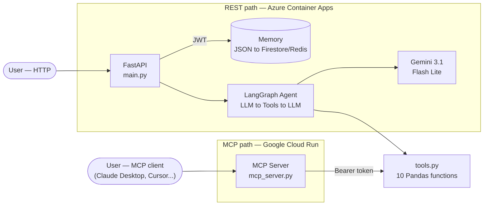

<div align="center">

# Sales Intelligence Agent

[](https://www.python.org/)
[](https://fastapi.tiangolo.com/)
[](https://langchain-ai.github.io/langgraph/)
[](https://cloud.google.com/)
[](https://ai.google.dev/)
[](https://azure.microsoft.com/)
[](https://modelcontextprotocol.io/)
[](https://www.docker.com/)
[](https://opensource.org/licenses/MIT)

**Conversational sales analysis agent with LangGraph + Model Context Protocol (MCP)**

</div>

> Natural language queries over enterprise sales data, without SQL or a BI dashboard. Two access paths — a REST API and an MCP server — share the same business logic and are deployed independently across Azure and Google Cloud.

## Architecture



Both paths call the exact same `tools.py` — no business logic duplicated. FastAPI owns the reasoning loop (LangGraph); MCP exposes the tools and lets the client's own LLM reason over them.

## Tech Stack

| Layer | Technology |
|---|---|
| **Orchestration** | LangGraph, LangChain |
| **LLM** | Google Gemini 3.1 Flash Lite |
| **API** | FastAPI, JWT auth |
| **Data** | Pandas, 15K+ transaction dataset |
| **Memory** | JSON (current) to Firestore/Redis (in progress) |
| **Infra** | Docker, Azure Container Apps (REST), Google Cloud Run + Artifact Registry (MCP) |
| **CI/CD** | GitHub Actions (tests + Docker build), Cloud Build (MCP deploy) |
| **Observability** | LangSmith tracing |
| **Testing** | 42 automated tests (Pytest) |

## Endpoints

| Method | Route | Description | Auth |
|---|---|---|---|
| POST | `/auth/token` | Obtain JWT token | Public |
| POST | `/chat` | Conversation, in-session memory | Bearer |
| POST | `/chat/persistent` | Conversation, persistent memory | Bearer |
| GET/DELETE | `/memory/{session_id}` | View / clear history | Bearer |

```bash
curl -X POST http://localhost:8000/chat \
  -H "Authorization: Bearer <TOKEN>" -H "Content-Type: application/json" \
  -d '{"session_id": "user-123", "question": "Who is the top seller?"}'
```

## LangGraph Agent

State graph with 3 nodes: `node_llm` (decides whether to call a tool) to `should_continue` (conditional) to `node_tools` (executes and returns to the LLM). 10 decoupled tools in `tools.py`, agnostic to the orchestrator — LangGraph on the REST path, the client's own LLM on the MCP path.

## Memory

| Backend | Status |
|---|---|
| `InSessionMemory` (RAM) | Active — dev/demo |
| `PersistentMemory` (local JSON) | Active — current default |
| `CosmosMemory` (Azure Cosmos DB) | Deprecated — code present, disconnected |
| Firestore / Redis | **In progress** — replacing local JSON now that both services run on GCP |

## MCP Server

`app/mcp_server.py` wraps `tools.py` directly — same 10 tools, no HTTP client or LangGraph knowledge required. Runs local over stdio or remote over streamable-http, bearer-token authenticated. Deployed on **Google Cloud Run**, built and released via `cloudbuild.yaml`:

```bash
gcloud builds submit --config cloudbuild.yaml \
  --substitutions=_REGION=us-central1,_REPO=sales-mcp-repo,_IMAGE=sales-intelligence-mcp,_SERVICE=sales-intelligence-mcp .
```

Each build is tagged and deployed by commit SHA (not `:latest`), so every release is traceable and rollback doesn't require a rebuild. `MCP_AUTH_TOKEN` lives in Secret Manager.

Claude Desktop only speaks local `stdio`, so reaching the remote Cloud Run instance goes through a small local bridge script (`claude-bridge.py`) that forwards stdio to HTTP with the bearer token. Clients with native remote MCP support (Cursor, Windsurf, VS Code+Cline) connect directly via URL — no bridge needed.

## Tests

```bash
pytest tests/test_tools.py -v   # 31 unit tests
pytest tests/test_api.py -v     # 11 integration tests (real Gemini API)
python test_langsmith.py        # 10-question smoke eval, traced to LangSmith
```

## Local Setup

```bash
pip install -r requirements.txt
# configure .env - see Environment Variables below
uvicorn app.main:app --reload   # then open http://localhost:8000/docs
```

## Environment Variables

| Variable | Purpose | Default |
|---|---|---|
| `GOOGLE_API_KEY` | Gemini API key | — |
| `JWT_SECRET_KEY` | JWT signing key | `dev-secret-key-change-in-production` |
| `MEMORY_BACKEND` | Memory backend (only `json` wired today) | `json` |
| `LANGCHAIN_TRACING_V2` / `LANGCHAIN_API_KEY` | LangSmith tracing | `false` / — |

---

**Author:** Bernardo Mantilla · **License:** MIT