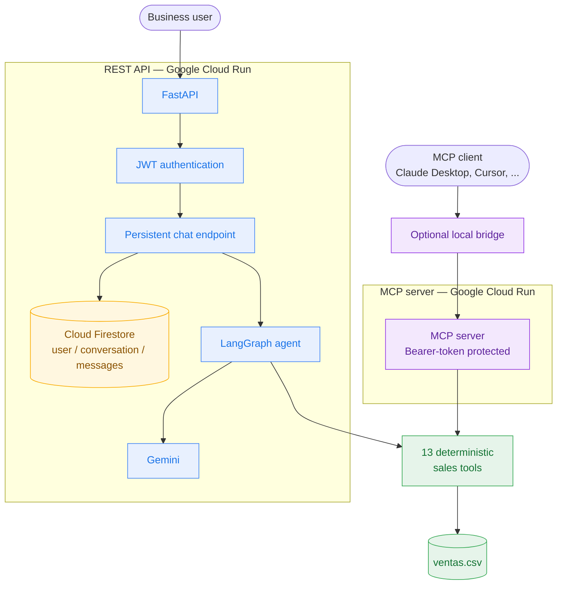

<div align="center">

# Sales Intelligence Agent

[](https://www.python.org/)
[](https://fastapi.tiangolo.com/)
[](https://langchain-ai.github.io/langgraph/)
[](https://cloud.google.com/firestore)
[](https://cloud.google.com/)
[](https://modelcontextprotocol.io/)
[](https://github.com/features/actions)
[](https://polyformproject.org/licenses/noncommercial/1.0.0)

**A production-oriented sales analysis agent: trusted calculations, conversational reasoning, and durable business context.**

</div>

> Ask business questions in natural language instead of writing SQL or navigating a BI dashboard. The REST API and MCP server share the same deterministic sales tools, while remaining independently deployable on Google Cloud Run.

## Architecture



### Design principles

- **The LLM interprets; tools calculate.** Sales metrics come from 13 deterministic Pandas functions, not model guesses.
- **REST owns reasoning and durable memory.** FastAPI combines LangGraph, JWT identity, and Firestore-backed conversation history.
- **MCP stays stateless.** It exposes the same tools for an MCP client whose own model handles the reasoning loop.
- **Memory is isolated by identity.** Firestore stores messages under `users/{user_id}/conversations/{conversation_id}`; `user_id` is derived from the validated JWT.
- **Releases are traceable.** CI/CD deploys immutable images tagged with the validated commit SHA; Cloud Run revisions support rollback.

## What is deployed

| Service | Responsibility | Production URL |
|---|---|---|
| `sales-agent` | FastAPI, LangGraph, JWT, Firestore memory | [API and Swagger](https://sales-agent-d5ck373ogq-uc.a.run.app/docs) |
| `sales-intelligence-mcp` | Stateless MCP access to sales tools | [MCP endpoint](https://sales-intelligence-mcp-d5ck373ogq-uc.a.run.app/mcp) |

Both services use the same `app/tools.py` module, avoiding duplicate business logic.

## Tech stack

| Layer | Technology |
|---|---|
| Agent orchestration | LangGraph, LangChain |
| LLM | Google Gemini 3.1 Flash Lite |
| REST API | FastAPI, JWT, rate limiting, configurable CORS |
| Persistent memory | Cloud Firestore (FastAPI production) |
| Sales calculations | Pandas over a 15K+ transaction dataset |
| MCP | Streamable HTTP in Cloud Run; stdio bridge for Claude Desktop |
| Infrastructure | Docker, Cloud Run, Artifact Registry, Secret Manager |
| Delivery | GitHub Actions, Workload Identity Federation, immutable images, smoke tests |
| Observability | LangSmith tracing |
| Tests | Pytest — 67 automated tests |

## API

All protected routes require `Authorization: Bearer <token>`. Obtain a token through `POST /auth/token`, then use the **Authorize** control in Swagger or send the header from your client.

| Method | Route | Description | Auth |
|---|---|---|---|
| GET | `/` | Health check | No |
| POST | `/auth/token` | Obtain a JWT access token | No |
| GET | `/ventas/resumen` | Deterministic sales summary | Yes |
| POST | `/chat` | Conversation with process-local, in-session memory | Yes |
| POST | `/chat/persistent` | Conversation with Firestore-backed memory | Yes |
| GET / DELETE | `/memory/{conversation_id}` | Read or clear history; use `?persistent=true` for Firestore | Yes |

### Persistent conversation example

Authenticate once through `POST /auth/token`. Then send both requests to
`POST /chat/persistent` with the same token and the same `conversation_id`.

**1. Save a piece of business context**

```json
{
  "conversation_id": "planning-q4",
  "question": "Remember that our goal is to increase sales by 20%."
}
```

**2. Ask for that context in a later request**

```json
{
  "conversation_id": "planning-q4",
  "question": "What is our sales objective?"
}
```

The second answer should identify the 20% sales-growth objective even though
the objective was not repeated. Firestore retrieves the prior messages because
both requests belong to the same authenticated user and `conversation_id`.
`session_id` remains accepted as an input alias during the API transition, but
new clients should use `conversation_id`.

## Local development

The CI and container images run Python 3.11. Local development has also been validated with Python 3.12.

```bash
# Create and activate an isolated environment
python -m venv .venv
# Windows PowerShell: .\.venv\Scripts\Activate.ps1
# macOS/Linux: source .venv/bin/activate

python -m pip install -r requirements.txt

# Configure local secrets in .env; never commit this file.
# For local tests, JSON memory avoids any Google Cloud dependency.
uvicorn app.main:app --reload
```

Open [http://localhost:8000/docs](http://localhost:8000/docs) to test the API interactively. Use `MEMORY_BACKEND=json` for local development or tests when Firestore credentials are not configured. Cloud Run explicitly uses `MEMORY_BACKEND=firestore`.

### Environment variables

| Variable | Purpose | Default |
|---|---|---|
| `GOOGLE_API_KEY` | Gemini API key | Required for agent requests |
| `JWT_SECRET_KEY` | JWT signing key | Required outside test environments |
| `MEMORY_BACKEND` | `firestore` for production or `json` for local development/tests | `firestore` |
| `PORT` | HTTP port injected by Cloud Run | `8080` |
| `RATE_LIMIT_PER_MINUTE` | Requests allowed per minute | `60` |
| `CORS_ALLOWED_ORIGINS` | Comma-separated approved browser origins | Unset (cross-origin disabled) |
| `JWT_EXPIRE_MINUTES` | Access-token lifetime | `60` |
| `GEMINI_MODEL` | Gemini model selected by the agent | `gemini-3.1-flash-lite` |
| `LANGCHAIN_TRACING_V2` | Enables LangSmith tracing | `false` |
| `LANGCHAIN_API_KEY` | LangSmith API key | Required when tracing is enabled |
| `LANGCHAIN_PROJECT` | LangSmith project name | `sales-agent` |

### MCP variables

| Variable | Purpose |
|---|---|
| `MCP_AUTH_TOKEN` | Bearer token that protects the MCP service |
| `MCP_TRANSPORT` | `stdio` locally or `streamable-http` in Cloud Run |
| `ALLOWED_HOST` | Expected Cloud Run host for MCP requests |
| `MCP_REMOTE_URL` | Optional bridge target when using Claude Desktop |

## Testing

Run the full suite locally without calling Firestore, Gemini, Secret Manager, or Cloud Run:

```powershell
$env:MEMORY_BACKEND='json'
$env:JWT_SECRET_KEY='test-only-key'
python -m pytest -q
```

The suite covers deterministic sales tools, API contracts, rate limiting, memory truncation, Firestore path/identity contracts, and user isolation. The CI workflow runs these tests and verifies both Docker images before production deployment.

## Delivery and operations

```text
push to main
  → CI tests and Docker verification
  → immutable image tagged with commit SHA
  → Cloud Run deployment through Workload Identity Federation
  → health / MCP smoke test
```

GitHub Actions authenticates to Google Cloud with Workload Identity Federation. Runtime secrets stay in Secret Manager; no Google credential file, API key, or JWT secret belongs in the repository or GitHub Actions variables.

Each service is deployed independently. A rollback is performed by moving Cloud Run traffic to a prior ready revision, without rebuilding an old image.

## Product vision

The platform is designed to evolve from conversational sales analysis into a trusted revenue intelligence copilot, extending its current foundation of deterministic calculations, durable context, and traceable operations.

Future enhancements may include scheduled insight summaries, opportunity alerts derived from sales signals, and collaborative workspaces with scoped business context. This direction builds on the production capabilities described above while keeping the product focused on reliable, explainable business decisions.

## Security note

The current API authentication is suitable for personal testing only and still includes demonstration users in the application code. Do not submit sensitive customer or production business data through the public Swagger endpoint. Before external access, replace demo authentication with a real identity provider and maintain secrets in Secret Manager.

---

**Author:** Bernardo Mantilla · **License:** [PolyForm Noncommercial 1.0.0](LICENSE)
